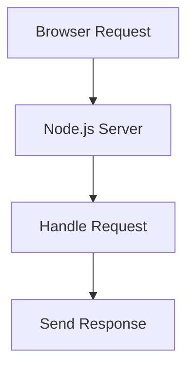

Today we are going to create a basic HTTP server using Node.js that will serve requests made by the browser over the HTTP protocol.

Before building the server, let's first understand what a server really is.

## What is a Server?

A server is basically a computer that serves web pages or data to clients.

It follows a **request-response cycle**:

1. The client sends a request
2. The server processes it
3. The server sends a response back

> Every time you open a website, your browser communicates with a server.

---

## Create `app.js`

Create a file called:

```bash
app.js
```

---

## Import HTTP Module

Node.js provides a built-in `http` **bold** module which allows us to create servers.

Since it's a core Node.js module, we don't need to install it using npm.

```js
const http = require("http");
```

---

## Create a Basic Server

The `http` module provides a method called `createServer()`.

This method takes a callback function with two parameters:

- `request`
- `response`

```js
http.createServer((request, response) => {});
```

### What do these parameters do?

| Parameter | Description                                     |
| --------- | ----------------------------------------------- |
| request   | Contains information about the incoming request |
| response  | Used to send data back to the client            |

## Listen on a Port

Before the server can respond to requests, we need to make it listen on a specific port.

```js
http
  .createServer((request, response) => {
    // handle request here
  })
  .listen(3000, "localhost");
```

### Explanation

- `3000` → Port number
- `"localhost"` → Hostname

> A hostname is basically the domain or website name.

---

## Send Response to the Client

Now let's send some data back to the browser.

We can use the `response.end()` method.

```js
http
  .createServer((request, response) => {
    response.end("Welcome");
  })
  .listen(3000, "localhost");
```

Now save the file and run:

```bash
node app.js
```

Open your browser and visit:

```bash
localhost:3000
```

You should now see:

```txt
Welcome
```

---

# Improving the Code Structure

Our server works, but we can organize the code better.

---

## Store Server in a Variable

```js
const http = require("http");

const server = http.createServer();
```

---

## Create Request Handler Separately

Instead of writing the callback inline, we can separate it into its own function.

```js
const http = require("http");

const server = http.createServer(handleRequest);

function handleRequest(req, res) {
  res.end("Welcome");
}
```

This makes the code cleaner and easier to maintain.

---

## Add Server Listener

Now let's make the server listen on port `3000`.

```js
const http = require("http");

const server = http.createServer(handleRequest);

function handleRequest(req, res) {
  res.end("Welcome");
}

server.listen(3000, () => {
  console.log("Server is listening on port 3000");
});
```

---

## Run the Server

Save the file and run:

```bash
node app.js
```

This time you should see:

```bash
Server is listening on port 3000
```

Now open:

```bash
localhost:3000
```

---

## Final Result

Congratulations 🎉

You created your first HTTP server using Node.js.

You learned:

- What a server is
- Request-response cycle
- How to use the `http` module
- How to create a server
- How to listen on a port
- How to send responses to clients

---

## Server Flow Diagram



---

## Final Code

```js
const http = require("http");

const server = http.createServer(handleRequest);

function handleRequest(req, res) {
  res.end("Welcome");
}

server.listen(3000, () => {
  console.log("Server is listening on port 3000");
});
```

---


